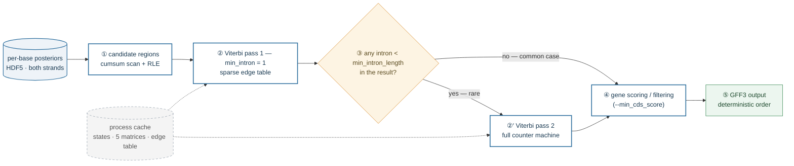

# Inside the ANNEVO-Fast Decoder

**English** | [中文](decoding-internals.zh-CN.md)

*How a gene-grammar HMM is made 3–5× faster without changing a single base of its output.*

This article explains the algorithms and engineering behind the decoding half
of ANNEVO-Fast (`decoding.py`, `src/HMM.py`, `src/gene_decoding.py`). It is
written to be read top-to-bottom by someone who knows what a genome and a
neural network are; every piece of jargon is defined the first time it
appears, and each section leads with the intuition before the detail.

All numbers below are measured on the code in this repository
(`min_intron_length = 20` unless stated otherwise).

### A one-minute glossary

| Term | Plain meaning in this context |
|---|---|
| *posterior* | the network's confidence, per base, for each of the 15 label classes ("87% exon, 3% intron, …") |
| *HMM* (hidden Markov model) | a state machine: a box of **states** plus a rulebook of **allowed moves** between them |
| *state* | one node of the machine ("currently inside an intron, 7 bases in") |
| *transition* | one legal move, with a score (e.g. "stay in intron: −0.05") |
| *emission* | the score for "state X agrees with the network's label at this base" |
| *Viterbi* | dynamic programming: the classic algorithm that finds the single best-scoring legal path through the machine, base by base |

---

## 1. What the decoder solves

Think of the neural network as a very fast, 98%-accurate typist, and the
decoder as its grammar checker.

An ANNEVO-style model outputs, for every genome base and both strands, a
posterior distribution over 15 label classes (shown in the model's training
label order):

```
0  Intergenic       5  Intron_1        10 ASS_0   (acceptor)
1  Coding_exon_0    6  Intron_2        11 ASS_1
2  Coding_exon_1    7  DSS_0           12 ASS_2
3  Coding_exon_2    8  DSS_1           13 start
4  Intron_0         9  DSS_2           14 end
```

98% accuracy sounds excellent — but the 2% of wrong bases are scattered at
random, and a gene is only correct if *every one of its bases* is right.
Taken literally (per-base argmax), the raw output contains genes with
3-base introns, donor sites with no acceptor, and reading frames that jump
arbitrarily between exons. None of these can exist in biology, so none
should exist in the output.

The decoder therefore finds the **highest-scoring path that is grammatically
legal**: it may flip some low-confidence bases to keep the story coherent,
but it may never break the rules. That is precisely what Viterbi decoding
over a hand-designed HMM computes.

The pipeline in one sentence: *threshold the posteriors to find candidate
regions, decode each region through the grammar machine, score and filter the
genes, write GFF3.* As a diagram:



*Figure 0 — how a decode job flows.* ① Cheap thresholding (a 50 bp window
mean plus a per-base high-confidence count; §5) prunes the genome down to a
handful of candidate regions, so the expensive Viterbi never runs on
intergenic desert. ② The first pass decodes with the counter chains
collapsed (`min_intron = 1`) — smaller machine, unconstrained optimum. ③ The
result is scanned for introns below the requested minimum; if none exist —
the common case — the path is already final and ②′ is skipped entirely
(§2.2). ④ Genes are scored and filtered (`--min_cds_score`, §6) and ⑤
written in deterministic order. The dashed grey cache holds the state tables,
the five conditional matrices and the compiled edge table; it is built once
per worker process and shared by every Viterbi call (§4.4), which is what
makes forking a process pool cheap.


***Figure 1 — the whole story in one picture.*** Read it left to right, top
to bottom:

- **(A) What the machine is made of.** State families of the HMM at
  `min_intron_length = 20` (§2.1). The gene grammar proper needs only
  **50 states**; the other **120** (red) are intron-length counter chains —
  6 suffix families × 20 counters — that exist purely to make introns
  shorter than 20 nt *topologically impossible*. The bookkeeping device, not
  the grammar, dominates S — and S is what the dense inner loop pays S² for.

- **(B) Why the dense loop is waste.** Every *finite* entry of the
  A-conditional transition matrix, plotted at its `(from, to)` coordinates:
  **160 lit cells out of 28,900 (0.6%)**. The data is not synthetic — the
  figure script imports the real HMM from this repository and plots the
  actual edge table. The dense horizontal bands are the counter chains (each
  counter has exactly one successor; §2.1); the structure near the origin is
  the CDS/splice grammar. The other four conditional matrices (T/C/G/N) look
  similar and share **879 edges in total**. A dense Viterbi compares against
  all 28,900 cells per base; the sparse one touches only the lit ones.

- **(C) What that saves per base.** Inner-loop candidate visits on a log
  scale: S² = 28,900 comparisons (the vast majority against −∞ weights that
  can never win) vs ≈ 176 edge visits — per base, only the current
  nucleotide's table is consulted, hence E/5 ≈ 879/5. The ≈164× reduction is
  the *inner-loop* ratio; end-to-end gains are smaller because I/O, region
  detection and formatting dominate after the rewrite (§7).

- **(D) What it buys in practice.** Wall-clock time of the full decode, 24
  CPU threads. The synthetic 2×5 Mb workload deliberately contains introns
  shorter than the minimum, exercising the two-pass re-decode path (§2.2);
  *A. thaliana* is a real ~120 Mb genome, both strands, 24,625 genes. Gene
  content is byte-identical to the reference decoder in both cases (§8).

One practical subtlety for anyone touching the emission code: the decoder
applies a **fixed column permutation** when feeding posteriors to the HMM
state groups — for every phase-structured family the two non-zero phases are
swapped between the label naming and the HMM phase groups (e.g. the HMM's
`CODING_EXON_1` states read prediction *column 3*, `DSS_1` reads column 9,
`ASS_2` reads column 11). The mapping is hard-coded in `viterbi_decoding`
and must match the checkpoint's training convention.

---

## 2. The gene-grammar HMM

The machine works like a board game with 170 squares (states) and a rulebook
that says which square may follow which, with a score for each legal move.
Walking the board base-by-base spells out a gene; Viterbi (§3) finds the
highest-scoring legal walk. The rulebook *is* the biology.

### 2.1 State inventory

At `min_intron_length = 20` the machine has **170 states** in seven families:

| Family | Count | Examples | Role |
|---|---|---|---|
| intergenic | 1 | `intergenic` | between genes |
| start codon | 3 | `start0..start2` | spells ATG |
| CDS, phase-tracked | 6 | `CDS0`, `CDS0_T`, `CDS1`, `CDS1_TA`, `CDS1_TG`, `CDS2` | exon body, position within the codon |
| donor/acceptor motifs | 12 | `DSS0`, `DSS1_TA`, `ASS2`, … | spell GT…AG around splice sites |
| stop codon | 4 | `end0`, `end1_TA`, `end1_TG`, `end2` | spell TAA / TAG / TGA |
| splice helpers | 24 | `intron1_TG_splice0..3` | consume the GT…AG motif inside introns |
| intron length counters | 120 | `intron0_17`, `intron2_0`, … | enforce `min_intron_length` |


*Figure 2 — the grammar backbone.* Blue: the CDS phase cycle — a gene body
is a walk around `CDS0 → CDS1 → CDS2 → CDS0`, one codon per lap; the start
codon (`ATG`) admits entry from `intergenic`, and the phase must come back to
the right position when the walk resumes after an intron. Orange: the splice
arc — a donor site (`GT`) enters the intron counters + motif helpers, walks
≥ 20 nt, and leaves through an acceptor (`AG`) back into the phase cycle
*frame-preserved*. Red: the stop path — `TAA`/`TAG`/`TGA` spelled after `CDS2`
closes the gene and returns to `intergenic`. Omitted for readability: the
suffix-tagged variants that carry partial codons across the splice arc
(§2.1), the second donor/acceptor arcs from `CDS1`/`ASS1`, and the N-base
fallback paths. The full machine instantiates this backbone with
`min_intron_length` counter levels per suffix family — 170 states at the
default 20 (Figure 1A).

Three design points deserve explanation.

**Keeping the reading frame across an intron.** A gene is read in
three-base codons, and an intron can interrupt a gene *between any two
bases* — even in the middle of a codon. When the machine walks into an
intron, it must remember how much of the current codon it has already seen,
or the frame will be wrong after the acceptor. It does this with suffix
tags: `CDS1_TA` means "codon position 1, and the codon so far reads TA".
The tags travel along the whole splice arc — CDS → donor → intron →
acceptor — through suffix-matched moves, for example
`CDS0_T --A--> DSS1_TA`, `DSS0_T --G--> intron0_T_splice0`,
`intron0_T_splice3 --A--> ASS1_TA`, `ASS1_TA --T--> CDS2`. Whatever
half-written codon existed before the donor is finished after the acceptor,
so the frame — and stop-codon recognition — resume on the right bases.

**Stops.** Stop codons are spelled by the dedicated red chain: `CDS2 → end0`
on T (the next in-frame codon starts with T), then `end0 → end1_TA` on A or `end1_TG` on G, then `end1 → end2`
(A completes TAA/TAG from `end1_TA`, and TGA from `end1_TG`). An acceptor exit can also begin a
stop directly (`intron2_splice3 → end0` on T — a phase-2 intron has already
finished its codon at the acceptor, so the next base starts a fresh one),
and `end2 → intergenic` closes the gene.

**Minimum intron length needs topology, not hints.** You cannot enforce
"introns must be ≥ 20 nt" with scores alone — the clean way is to make
short introns *unrepresentable*: 20 counter states in a row, each with
exactly one successor. Any legal walk through them takes at least 20 steps.
This is why the counters are 120 of the 170 states (Figure 1A), and why the
machine grows linearly with `min_intron_length`.

**Nucleotide-conditional moves.** There are **five** rulebooks (transition
matrices) — one each for the current base being A, T, C, G, or N — because
the grammar is DNA-aware: `start1 → start2` fires only on G (completing
ATG), donors enter only on G, and the GC-AG donor pays a penalty on C. Under
N (an ambiguous base, common in assemblies) every conditional move opens
with a fixed −10 penalty, so gaps degrade gracefully instead of breaking
genes.

**Emissions.** Emission scores are simply the network's posteriors for the
state's class (floored at ε = 1e-3 and logged) — the machine's scores come
from the rulebook, its "evidence" from the network.

### 2.2 Two-pass decoding

Enforcing `min_intron_length` with counter states can *force* a worse path
when the unconstrained best path contains no short intron at all (the
counters make the machine stiffer than necessary). The decoder therefore
decodes twice: first with `min_intron_length = 1` (counters collapsed),
then — only if the result actually contains an intron shorter than the
target — re-decodes with the full counter machine
(`decode_gene_structure`). In practice the second pass is rare; skipping it
when unnecessary is both faster and slightly more accurate.

---

## 3. The bottleneck: dense Viterbi

The textbook Viterbi update asks, at every base: *for each state I could be
in now, which previous state gave the best score?* With S states that is
S × S comparisons per base. With S = 170: **28,900 comparisons per base,
per strand** — for a 10 Mb chromosome, on the order of 3×10¹¹ comparisons.

Here is the waste: the rulebook is almost empty (Figure 1B). From a typical
state only **1–4 moves are legal**; all other 166-odd "previous states"
have weight −∞ and can never win. The dense algorithm spends almost all of
its time checking moves that are illegal — like finding the previous
station on a subway line by phoning *every* station in the city, when the
map plainly lists the two or three that connect.

On top of the dense loop itself, two aggravators made the reference
pipeline worse: five S×S matrices rebuilt in Python loops **for every candidate
region**, although they depend only on five parameters; and per-base
dictionary lookups for encoding.

---

## 4. The fix: pre-compute the legal moves — O(L·E)

### 4.1 The data structure

Instead of five S×S grids, keep one flat list of the legal moves — the
subway map itself, in a form the inner loop can walk without thinking:

```
edge_from[e]  : source state of move e        (int32)
edge_w[e]     : score of move e               (float32)
to_ptr[s, j]  : moves INTO target state j, when the current base is symbol s,
                occupy the contiguous range [to_ptr[s, j], to_ptr[s, j+1])
```

Moves are concatenated per symbol in **(target, source) ascending** order
(`np.lexsort((fr, to))`), so `to_ptr` is a plain prefix-sum index.
Concretely, for one symbol's table the memory looks like this:

```
                       target state j        target state j+1
                     ┌ ─ ─ ─ ─ ─ ─ ─ ─ ─ ┬ ─ ─ ─ ─ ─ ─ ─ ─ ─ ┐
 to_ptr[s, j] ──►    │ e=7  e=8  e=9  e=10 │ e=11 e=12 ...
                     │ (from, w) pairs ...  │
 edge_from  [ 7] =    3     41    77   112     5    88   ...
 edge_w     [ 7] =  -2.1  -0.4  -3.7  -2.1   -0.4  -5.0  ...
                     └ ─ ─ ─ ─ ▲ ─ ─ ─ ─ ─ ┴ ─ ─ ─ ─ ▲ ─ ─ ─ ┘
                        to_ptr[s, j]        to_ptr[s, j+1]

 within a target block, moves are sorted by source index ascending —
 the FIRST (lowest) source wins ties under the strict ">" update,
 exactly matching the reference's for-i-in-0..S-1 loop
```

At `min_intron_length = 20` the five rulebooks contain **879 legal moves in
total** (vs. 5 × 28,900 = 144,500 dense cells). Per base only the current
nucleotide's rulebook is consulted — on average **~176 move visits per
base** instead of 28,900 state-pair comparisons, a ≈164× reduction of the
inner loop (Figure 1C).

*Listing — anatomy of the edge table (indices illustrative).* Three parallel
flat arrays replace five S×S grids: `edge_from`/`edge_w` hold the source
state and score of every legal move, concatenated per symbol; `to_ptr` is a
prefix sum over targets, so `[to_ptr[s, j], to_ptr[s, j+1])` is exactly the
set of moves **into** target state `j` when the current base is symbol `s` —
here the four moves `e=7..10`. No search, no masking, no −∞ scan: the
Viterbi update for one (base, state) pair is a bounded walk over that slice.
And the within-block ascending-source order is not just a layout choice —
it *is* the tie-breaking rule of §4.3, so the memory layout and the
correctity argument are the same artifact.

### 4.2 The kernel

```python
@njit(cache=True)
def _viterbi_core_sparse_f32(log_emit_probs, edge_from, edge_weight, to_ptr, sequence_codes):
    for t in range(1, seq_length):
        sym = sequence_codes[t]
        for to_state in range(num_states):
            best_score = -inf; best_from = 0
            emit = log_emit_probs[t, to_state]
            for e in range(to_ptr[sym, to_state], to_ptr[sym, to_state + 1]):
                score = dp[t-1, edge_from[e]] + edge_weight[e] + emit
                if score > best_score:      # strict greater-than
                    best_score = score; best_from = edge_from[e]
            dp[t, to_state] = best_score
            path[t, to_state] = best_from
```

The inner loop is a tight walk over contiguous memory — exactly the shape
the numba JIT compiler turns into fast machine code, and exactly the shape
a dense `numpy` row-max cannot express without materializing S×S
intermediates. Two precision variants are compiled (f32 for regions ≤ 1 Mb,
f64 above), mirroring the reference decoder's dtype choice so results stay
identical in both regimes.

### 4.3 Making it bit-exact — the actual constraints

Speed was never the hard part; **identical output** was. Anyone can write a
faster decoder that is *almost* the same; the requirement here was that
downstream tooling sees the same genes as before. Three rules make the
sparse kernel produce the same scores, the same backpointers, and hence the
same decoded path as the dense reference — not statistically, but bit for
bit:

1. **Add in the same order.** The candidate score is computed as
   `(dp_prev + w) + emit` — the same left-to-right grouping as the
   reference. Floating-point addition rounds differently depending on
   grouping, and a one-ulp difference at base 4,000,001 can flip a path.
2. **Break ties the same way.** When two moves score *exactly* equally,
   both implementations keep the one from the smallest-numbered state: the
   reference got this implicitly from looping `i = 0..S-1` with a strict
   `>`; the sparse table reproduces it by sorting moves by source index and
   using the same strict `>`.
3. **Build the table deterministically.** The `lexsort` construction is a
   pure function of its parameters, so every process builds the identical
   table.

### 4.4 Everything else is cached

The states, the five rulebooks, and the compiled edge table are built once
per process and memoized on
`(min_intron_length, expect_exon, expect_intron, gcag, atac)` — the
reference rebuilt them per region. numba kernels are cached on disk
(`cache=True`), so the workers of the process pool pay neither the JIT nor
the construction. Base encoding is a 256-entry lookup table over the raw
ASCII buffer instead of a per-base dictionary — small, but it matters at
10⁷ bases per chromosome.

---

## 5. Vectorizing everything around the kernel

Rewriting Viterbi would have been pointless if the rest of the pipeline
stayed in Python loops. Each stage was reworked with numpy under the same
"same result, bit for bit" discipline:

| Stage | Reference | This repo |
|---|---|---|
| candidate regions | per-50bp-window Python loop | `cumsum` window sums + run-length extraction; identical mean formula |
| region merge | interval union, 100 bp buffer | unchanged |
| state → class collapse | per-base set membership | lookup table + `np.take` |
| CDS/intron ranges | `pandas.groupby(...).apply(lambda ...)` | numpy run-length encoding (pandas dependency removed) |
| gene score | triple per-base Python loop | vectorized slice sums; **float64 sequential `cumsum`** preserving the reference's left-to-right accumulation order |
| H5 access | one file open per segment | one open per 16-segment batch |
| output order | process-completion order (nondeterministic) | chromosomes in lexicographic order |

The float64 row is §4.3 in miniature: a gene score is a sum of millions of
posteriors, and numpy's default `sum` (pairwise) rounds differently than the
reference's sequential accumulation — enough to flip a gene across the
`--min_cds_score` filter. The `cumsum`-then-take-last formulation keeps the
sums identical. Parallelism is a flat `ProcessPoolExecutor` over batches of
regions; after the first batch, every worker is hot (§4.4).

---

## 6. Knobs that trade a little speed for accuracy

Three optional behaviors; the first two leave the default output completely
unchanged:

- **`--atac_penalty <x>`** — adds AT-AC (U12-type minor splice) states:
  donors preceded by AT, acceptors ending in C. Nine extra states; the
  reading-frame bookkeeping is approximated away on this path (≈0.1% of
  introns).
- **`--gcag_penalty`** — extra log penalty of GC-AG donors relative to
  canonical GT (default 10, the historical value).
- **`--min_cds_score`** — mean per-base emission score a gene must reach
  (single-exon and short genes face 1.5×). The default 0.6 (vs the
  historical 0.5) was re-calibrated on plant benchmarks and is worth
  **+0.2–0.4 pp gene F1**. Unlike the two above it changes output by
  design; set it to 0.5 to reproduce historical filtering.

---

## 7. Results and where the time went

24 CPU threads, output gene content identical to the reference decoder:

| Task | Reference | This repo | Speed-up |
|---|---|---|---|
| Synthetic 2×5 Mb, 6,047 genes (exercises the short-intron re-decode path) | 17.9 s | 3.4 s | **5.3×** |
| *Arabidopsis thaliana* whole genome, 24,625 genes | 59.4 s | 22.3 s | **2.7×** |

Why does a ~164× smaller inner loop yield "only" 2.7–5.3× end-to-end?
Because after the rewrite, the inner loop is simply gone from the profile:
the remaining time is reading the H5 posteriors, finding candidate regions,
formatting and writing GFF, and process-pool overhead. Shrinking something
that is no longer the bottleneck cannot shrink the total further — the
familiar Amdahl's law. (On fragmented draft assemblies the *predictor* side
— cross-scaffold chunked batching — is the bigger lever; see the README.)

---

## 8. Verifying a rewrite like this

The equivalence claim rests on three layers, in increasing strength:

1. **Determinism by construction** — the edge table is a pure function of
   its parameters; decoded paths are reproducible across runs and processes.
2. **Differential testing on synthetic data** — genomes with known ground
   truth, deliberately including introns shorter than `min_intron_length`
   to force the re-decode path; GFFs compared byte-for-byte.
3. **Whole-genome differential runs** — real *A. thaliana*: 24,625 genes on
   both strands; all gene content lines identical between reference and
   this decoder. (Only the order of per-sequence comment blocks differed —
   the reference emitted them in process-completion order, which was itself
   nondeterministic run to run; this repo emits lexicographic order.)

Layer 3 carries a lesson for anyone porting this approach: **define "the
same answer" to include tie-breaking and floating-point rounding**, or your
diff will fill with one-base shifts that are really just
different-but-equally-optimal paths.

---

## 9. Summary

| Aspect | Reference | This repo |
|---|---|---|
| Viterbi inner loop | O(L·S²) dense — ~28,900 comparisons/base | O(L·E) sparse edge table — ~176 move visits/base |
| Transition tables | rebuilt per region | built once per process, memoized; numba disk cache |
| Precision policy | f32 / f64 per region length | same, both kernels compiled |
| Equivalence | — | bit-exact paths (fixed evaluation order + ascending-source tie-breaking) |
| Pipeline | pandas + Python loops | numpy run-length/cumsum throughout, no pandas |
| H5 access | open per segment | open per batch |
| Output | nondeterministic section order | deterministic lexicographic |
| Extras | — | AT-AC path, GC-AG knob, calibrated CDS filter |

The general lesson travels beyond gene finding: **a structured HMM is almost
always sparse, and a dense implementation is blind to that sparsity.**
Writing the rulebook down as an edge table — with deliberate control of
summation order and tie-breaking — turns an O(S²) kernel into O(E) while
*strengthening*, not weakening, the reproducibility guarantee.
