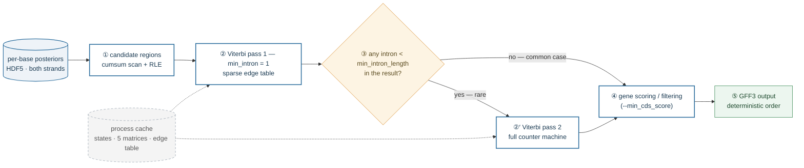
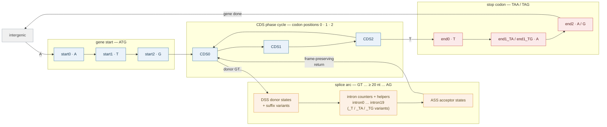

# Inside the ANNEVO-Fast Decoder

*How a gene-grammar HMM is made 3–5× faster without changing a single base of its output.*

This article explains the algorithms and engineering behind the decoding half of
ANNEVO-Fast (`decoding.py`, `src/HMM.py`, `src/gene_decoding.py`): what the hidden
Markov model does, why its Viterbi decode was the bottleneck, how the sparse-edge
rewrite works, what "bit-exact equivalence" actually guarantees and how it is
enforced, and where the remaining runtime goes.

All numbers below are measured on the code in this repository
(`min_intron_length = 20` unless stated otherwise).

---

## 1. What the decoder solves

An ANNEVO-style model outputs, for every genome base and both strands, a
posterior distribution over 15 label classes (shown in the model's training
label order):

```
0  Intergenic       5  Intron_1        10 ASS_0   (acceptor)
1  Coding_exon_0    6  Intron_2        11 ASS_1
2  Coding_exon_1    7  DSS_0           12 ASS_2
3  Coding_exon_2    8  DSS_1           13 start
4  Intron_0         9  DSS_2           14 end
```

One subtlety that bites anyone touching the emission code: the decoder applies
a **fixed column permutation** when feeding these posteriors to the HMM state
groups — for every phase-structured family the two non-zero phases are swapped
between the label naming and the HMM phase groups (e.g. the HMM's
`CODING_EXON_1` states read prediction *column 3*, `DSS_1` reads column 9,
`ASS_2` reads column 11). The mapping is hard-coded in `viterbi_decoding` and
must match the checkpoint's training convention.

Per-base argmax is not enough to produce gene structures. The raw posteriors
satisfy the *gene grammar* only statistically: an argmax path can contain an
intron that is 3 bp long, a donor site not followed by an acceptor, a CDS phase
that jumps arbitrarily between exons. The decoder's job is to find the
**highest-scoring path that is grammatically legal** — this is exactly a
Viterbi decode over a hand-designed HMM whose topology encodes eukaryotic gene
structure.

The pipeline in one sentence:

```
per-base posteriors (HDF5)
   → candidate genic regions (cheap thresholds)
   → per-region Viterbi over the grammar HMM
   → gene scoring / filtering
   → GFF3
```

The same pipeline as a diagram:



*Figure 0 — how a decode job flows.* ① Cheap thresholding (a 50 bp window
mean plus a per-base high-confidence count; §5) prunes the genome down to a
handful of candidate regions, so the expensive Viterbi never runs on
intergenic desert. ② The first pass decodes with the counter chains
collapsed (`min_intron = 1`) — smaller machine, unconstrained optimum. ③ The
result is scanned for introns below the requested minimum; if none exist —
the common case — the path is already final and ②′ is skipped entirely
(§2.3). ④ Genes are scored and filtered (`--min_cds_score`, §6) and ⑤
written in deterministic order. The dashed grey cache holds the state tables,
the five conditional matrices and the compiled edge table; it is built once
per worker process and shared by every Viterbi call (§4.4), which is what
makes forking a process pool cheap.


***Figure 1 — the whole story in one picture.*** Read it left to right, top
to bottom:

- **(A) What the machine is made of.** State families of the HMM at
  `min_intron_length = 20` (§2.1). The gene grammar proper needs only
  **50 states**; the other **120** (red) are intron-length counter chains —
  6 suffix families × 20 counters — that exist purely to make introns
  shorter than 20 nt *topologically impossible*. The bookkeeping device, not
  the grammar, dominates S — and S is what the dense inner loop pays S² for.

- **(B) Why the dense loop is waste.** Every *finite* entry of the
  A-conditional transition matrix, plotted at its `(from, to)` coordinates:
  **160 lit cells out of 28,900 (0.6%)**. The data is not synthetic — the
  figure script imports the real HMM from this repository and plots the
  actual edge table. The dense horizontal bands are the counter chains (each
  counter has exactly one successor; §2.1); the structure near the origin is
  the CDS/splice grammar. The other four conditional matrices (T/C/G/N) look
  similar and share **879 edges in total**. A dense Viterbi compares against
  all 28,900 cells per base; the sparse one touches only the lit ones.

- **(C) What that saves per base.** Inner-loop candidate visits on a log
  scale: S² = 28,900 comparisons (the vast majority against −∞ weights that
  can never win) vs ≈ 176 edge visits — per base, only the current
  nucleotide's table is consulted, hence E/5 ≈ 879/5. The ≈164× reduction is
  the *inner-loop* ratio; end-to-end gains are smaller because I/O, region
  detection and formatting dominate after the rewrite (§7).

- **(D) What it buys in practice.** Wall-clock time of the full decode, 24
  CPU threads. The synthetic 2×5 Mb workload deliberately contains introns
  shorter than the minimum, exercising the two-pass re-decode path (§2.3);
  *A. thaliana* is a real ~120 Mb genome, both strands, 24,625 genes. Gene
  content is byte-identical to the reference decoder in both cases (§8).

---

## 2. The gene-grammar HMM

### 2.1 State inventory

At `min_intron_length = 20` the machine has **170 states**. They fall into
five families:

| Family | Count | Examples | Role |
|---|---|---|---|
| intergenic | 1 | `intergenic` | background |
| start codon | 3 | `start0..start2` | spells ATG |
| CDS, phase-tracked | 6 | `CDS0`, `CDS0_T`, `CDS1`, `CDS1_TA`, `CDS1_TG`, `CDS2` | exon body in reading frame 0/1/2 |
| donor/acceptor motifs | 12 | `DSS0`, `DSS1_TA`, `ASS2`, … | spell GT…AG around splice sites |
| stop codon | 4 | `end0`, `end1_TA`, `end1_TG`, `end2` | spell TAA/TAG/TGA |
| splice helpers | 24 | `intron1_TG_splice0..3` | consume the GT…AG motif inside introns |
| intron length counters | 120 | `intron0_17`, `intron2_0`, … | enforce `min_intron_length` |

Three design points deserve explanation. First, the overall shape of the
grammar — the backbone every path follows (phase cycle in the middle, splice
arc below, stop path to the right):



*Figure 2 — the grammar backbone.* Blue: the CDS phase cycle — a gene body
is a walk around `CDS0 → CDS1 → CDS2 → CDS0`, one codon per lap; the start
codon (`ATG`) admits entry from `intergenic`, and the phase must come back to
the right position when the walk resumes after an intron. Orange: the splice
arc — a donor site (`GT`) enters the intron counters + motif helpers, walks
≥ 20 nt, and leaves through an acceptor (`AG`) back into the phase cycle
*frame-preserved*. Red: the stop path — `TAA`/`TAG` spelled after `CDS2`
closes the gene and returns to `intergenic`. Omitted for readability: the
suffix-tagged variants that carry partial codons across the splice arc
(§2.1), the second donor/acceptor arcs from `CDS1`/`ASS1`, and the N-base
fallback paths. The full machine instantiates this backbone with
`min_intron_length` counter levels per suffix family — 170 states at the
default 20 (Figure 1A).

**Phase tracking across introns.** `CDS0/1/2` encode the position within the
current codon, and the suffix-tagged variants track the *partial codon
itself*: `CDS1_TA` means "phase-1 position, codon so far reads TA". The
suffixes propagate along the whole splice arc — CDS → donor → intron →
acceptor — through suffix-matched transitions, e.g.
`CDS0_T --A--> DSS1_TA`, `DSS0_T --G--> intron0_T_splice0`,
`intron0_T_splice3 --A--> ASS1_TA`, `ASS1_TA --T--> CDS2`. A partial codon
begun before the donor is therefore completed after the acceptor: the reading
frame survives the intron, and stop recognition resumes on the right bases.

Stops themselves are spelled by the dedicated `end` chain: `CDS2 → end0` on T
(the next in-frame codon starts with T), `end0 → end1_TA`/`end1_TG` on A/G,
`end1_* → end2`. An acceptor exit can also start a stop directly
(`intron2_splice3 → end0` on T — the phase-2 intron has completed its codon at
the acceptor, so the next base begins a fresh one), and `end2 → intergenic`
closes the gene.

**Intron length counters.** A hard minimum intron length cannot be enforced by
emissions; it needs topology. The machine instantiates `min_intron_length`
counter states per suffix family (`intron0_0 … intron0_19`), forming chains
that make any intron shorter than the minimum topologically impossible. This
is the single biggest multiplier on state count (120 of the 170 states).

**Nucleotide-conditional transitions.** There are **five** separate S×S
transition matrices — one each for the current base being A, T, C, G, and N.
The grammar is DNA-aware: `start1 → start2` fires only on G (completing ATG),
donor entry fires only on G after DSS, the GC-AG donor pays a penalty on C,
and so on. Under N (ambiguous base) every conditional path opens with a fixed
−10 penalty so assembly gaps degrade gracefully.

### 2.2 Emissions

Emissions are not learned: each state simply reads the model's posterior for
its class group (`columns_dict` maps the 15 classes onto state groups, e.g.
`CODING_EXON_1 ← CDS1, CDS1_TA, CDS1_TG`), floored at ε = 1e-3 and logged.
Transition weights are also fixed log-probabilities derived from expected
exon/intron lengths (`log(1 − 1/E)`, `log(1/E)`), plus motif penalties.

### 2.3 Two-pass decoding

Enforcing `min_intron_length` with counter states can *force* a worse path
when the unconstrained best path contains no short intron at all. The decoder
therefore decodes twice: first with `min_intron_length = 1` (counter chains
collapsed), then — only if the result actually contains an intron shorter
than the target — re-decodes with the full counter machine
(`decode_gene_structure`). In practice the second pass is rare, and skipping
it when unnecessary is both faster and slightly more accurate.

---

## 3. The bottleneck: dense Viterbi

Textbook Viterbi over S states is O(L·S²): for every base, for every target
state, maximize over all S predecessor states. With S = 170 that is
**28,900 candidate comparisons per base, per strand** — and the vast majority
are comparisons against −∞ weights that can never win, because the grammar is
extremely sparse: almost every state has only **1–4 legal predecessors**.

The dense formulation wastes the work three times over:

1. the inner maximization scans all S predecessors although only a handful are
   finite;
2. the five conditional matrices are S×S each, so any per-region
   (re)construction in Python loops is itself expensive;
3. in the reference pipeline the matrices were rebuilt for **every candidate
   region**, although they depend only on
   `(min_intron_length, expect_exon, expect_intron, gcag, atac)`.

---

## 4. The core rewrite: sparse-edge Viterbi, O(L·E)

### 4.1 The data structure

Extract the finite entries of the five transition matrices into a flat,
CSR-like edge table:

```
edge_from[e]  : source state of edge e        (int32)
edge_w[e]     : log transition weight of e    (float32)
to_ptr[s, j]  : edges into target state j under symbol s occupy
                the contiguous range [to_ptr[s, j], to_ptr[s, j+1])
```

Edges are globally concatenated per symbol in **(target, source) ascending**
order (`np.lexsort((fr, to))`), so `to_ptr` is a plain prefix-sum index.
Concretely, for one symbol's table the memory looks like this:

```
                       target state j        target state j+1
                     ┌ ─ ─ ─ ─ ─ ─ ─ ─ ─ ┬ ─ ─ ─ ─ ─ ─ ─ ─ ─ ┐
 to_ptr[s, j] ──►    │ e=7  e=8  e=9  e=10 │ e=11 e=12 ...
                     │ (from, w) pairs ...  │
 edge_from  [ 7] =    3     41    77   112     5    88   ...
 edge_w     [ 7] =  -2.1  -0.4  -3.7  -2.1   -0.4  -5.0  ...
                     └ ─ ─ ─ ─ ▲ ─ ─ ─ ─ ─ ┴ ─ ─ ─ ─ ▲ ─ ─ ─ ┘
                        to_ptr[s, j]        to_ptr[s, j+1]

 within a target block, edges are sorted by source index ascending —
 the FIRST (lowest) source wins ties under the strict ">" update,
 exactly matching the reference's for-i-in-0..S-1 loop
```

The inner loop therefore scans one contiguous slice per (base, target state).
*Listing — anatomy of the edge table (indices illustrative).* Three parallel
flat arrays replace five S×S matrices: `edge_from`/`edge_w` hold the source
state and log-weight of every finite edge, concatenated per symbol; `to_ptr`
is a prefix sum over targets, so `[to_ptr[s, j], to_ptr[s, j+1])` is exactly
the set of edges **into** target state `j` when the current base is symbol
`s` — here the four edges `e=7..10`. No search, no masking, no −∞ scan: the
Viterbi update for one (base, state) pair is a bounded walk over that slice.
And the within-block ascending-source order is not just a layout choice — it
*is* the tie-breaking rule of §4.3, so the memory layout and the correctness
argument are the same artifact.

At `min_intron_length = 20` the five tables contain **879 edges in total**
(vs. 5 × 28,900 = 144,500 dense cells). Per base only one symbol's table is
consulted — on average **~176 edge visits per base** instead of 28,900 state
pairs, an ~160× reduction of the inner loop.

### 4.2 The kernel

```python
@njit(cache=True)
def _viterbi_core_sparse_f32(log_emit_probs, edge_from, edge_weight, to_ptr, sequence_codes):
    for t in range(1, seq_length):
        sym = sequence_codes[t]
        for to_state in range(num_states):
            best_score = -inf; best_from = 0
            emit = log_emit_probs[t, to_state]
            for e in range(to_ptr[sym, to_state], to_ptr[sym, to_state + 1]):
                score = dp[t-1, edge_from[e]] + edge_weight[e] + emit
                if score > best_score:      # strict greater-than
                    best_score = score; best_from = edge_from[e]
            dp[t, to_state] = best_score
            path[t, to_state] = best_from
```

This is a tight scalar loop over contiguous memory — exactly the shape numba
compiles well, and exactly the shape that a dense `numpy` row-max cannot
express without materializing S×S intermediates.

Two precision variants are compiled (`f32` for regions ≤ 1 Mb, `f64` above),
mirroring the reference decoder's dtype choice so that results remain
identical in both regimes.

### 4.3 Making it bit-exact — the actual constraints

Speed was never the hard part; **identical output** was. Three rules make the
sparse kernel produce the same `dp` values, the same backpointers, and hence
the same decoded path as the dense reference, bit for bit:

1. **Evaluation order.** The candidate score is computed as
   `(dp_prev + w) + emit` — the same left-to-right association as the
   reference's dense loop. Floating-point addition is not associative, so any
   other grouping could flip a comparison somewhere.
2. **Tie-breaking.** Within a target state, edges are sorted by source index
   ascending and the update uses strict `>`. The first (lowest-index) source
   wins ties — which is precisely what the reference's `for i in 0..S-1` loop
   with strict `>` produces.
3. **Deterministic construction.** The edge table is built by a fixed
   `lexsort`, so process restarts produce identical layouts.

With those three rules the sparse result is not merely statistically
equivalent — `np.array_equal` on decoded paths holds for arbitrary inputs.
This is what allows the decoder to be swapped in as a drop-in replacement:
downstream tooling that consumed the reference GFFs sees the same genes.

### 4.4 Everything else is cached

State tables, the five transition matrices, and the compiled edge table are
built once per process and memoized on
`(min_intron_length, expect_exon, expect_intron, gcag, atac)`
(`_HMM_ARTIFACTS_CACHE`); numba kernels are cached on disk (`cache=True`) so
worker processes forked by the `ProcessPoolExecutor` pay neither the JIT nor
the table construction. The reference rebuilt the matrices per region.

Base encoding is a 256-entry LUT over the raw ASCII buffer
(`np.frombuffer`) instead of a per-base dictionary lookup — a small thing
that matters at 10⁷ bases per chromosome.

---

## 5. Vectorizing everything around the kernel

The Viterbi rewrite would have been pointless if the rest of the pipeline
stayed in Python loops. `gene_decoding.py` reworks each stage with numpy,
under the same equivalence discipline (identical arithmetic order where sums
are involved):

| Stage | Reference | This repo |
|---|---|---|
| candidate regions | per-50bp-window Python loop | `cumsum` window sums + run-length extraction; identical mean formula |
| region merge | interval union, 100 bp buffer | unchanged |
| state → class collapse | per-base set membership | lookup table + `np.take` |
| CDS/intron ranges | `pandas.groupby(...).apply(lambda ...)` | numpy run-length encoding (pandas dependency removed) |
| gene score | triple per-base Python loop | vectorized slice sums; **float64 sequential `cumsum`** preserving the reference's left-to-right accumulation order |
| H5 access | one file open per segment | one open per 16-segment batch |
| output order | process-completion order (nondeterministic) | chromosomes in lexicographic order |

The float64 detail in the last-but-two rows is the same story as §4.3 in
miniature: gene scores are sums of millions of posteriors, and a
pairwise-parallel reduction (`np.sum`) can round differently than the
reference's sequential accumulation — which could flip a gene across the
`--min_cds_score` filter. The sequential `cumsum`-then-take-last formulation
keeps the sums bit-identical.

Parallelism is a flat `ProcessPoolExecutor` over batches of candidate
regions; the per-worker caches of §4.4 make each worker hot after its first
batch.

---

## 6. Knobs that trade a little speed for accuracy

Three optional behaviors leave the historical default path completely
unchanged but can be enabled at the CLI:

- **`--atac_penalty <x>`** — adds AT-AC (U12-type minor splice) helper states
  (`intron{p}_ATAC_splice{0,1,3}`): donor preceded by AT, acceptor ending in
  C. Nine extra states per machine; the stop-codon suffix tracking is
  approximated away on this path (≈0.1% of introns).
- **`--gcag_penalty`** — the extra log penalty of GC-AG donors relative to
  canonical GT (default 10, the historical value; it is a transition-weight
  offset in the C-conditional matrix, visible in §2.1's suffix machinery).
- **`--min_cds_score`** — mean per-base emission score a gene must reach
  (single-exon and short genes face 1.5×). The default 0.6 (vs the historical
  0.5) was re-calibrated on plant benchmarks and is worth **+0.2–0.4 pp gene
  F1**. Unlike the two above it changes output by design; set it to 0.5 to
  reproduce historical filtering.

---

## 7. Results and where the time went

24 CPU threads, output gene content identical to the reference decoder:

| Task | Reference | This repo | Speed-up |
|---|---|---|---|
| Synthetic 2×5 Mb, 6,047 genes (exercises the short-intron re-decode path) | 17.9 s | 3.4 s | **5.3×** |
| *Arabidopsis thaliana* whole genome, 24,625 genes | 59.4 s | 22.3 s | **2.7×** |

Why does a ~160× reduction of the inner loop yield "only" 2.7–5.3×? Because
after the rewrite the profile rebalances: H5 I/O, region detection, GFF
formatting, process-pool overhead, and the *unavoidable* O(L·E) scan dominate.
The dense comparison count was so large that the reference was largely
memory-bandwidth-bound on matrices full of −∞; the sparse kernel is small and
fast, and the remaining wall time is honest work elsewhere. On fragmented
draft assemblies the *predictor* side (cross-scaffold chunked batching) is
the larger lever — see the README.

## 8. Verifying a rewrite like this

The equivalence claim rests on three layers, in increasing strength:

1. **Unit-level determinism** — edge-table construction is a pure function of
   its cache key; decoded paths are reproducible across runs and processes.
2. **Differential testing on synthetic data** — a generator producing
   genomes with known ground truth, deliberately including introns shorter
   than `min_intron_length` to trigger the re-decode path, GFFs compared
   byte-for-byte.
3. **Whole-genome differential runs** — real *A. thaliana*: 24,625 genes on
   both strands; all gene content lines identical between reference and this
   decoder (only the order of the per-sequence comment blocks differed — the
   reference emitted them in process-completion order, which was itself
   nondeterministic run-to-run; this repo emits lexicographic order).

Rule 3 deserves emphasis for anyone porting this approach: **"the same
answer" must be defined including tie-breaking and float rounding**, or the
diff will be full of mysterious one-base shifts that are really just
different-but-equally-optimal paths.

---

## 9. Summary

| Aspect | Reference | This repo |
|---|---|---|
| Viterbi inner loop | O(L·S²), dense, ~28,900 comparisons/base | O(L·E), sparse CSR edge table, ~176 edge visits/base |
| Transition tables | rebuilt per region | built once per process, memoized; numba disk cache |
| Precision policy | f32 / f64 per region length | same, both kernels compiled |
| Equivalence | — | bit-exact paths (fixed evaluation order + ascending-source tie-breaking) |
| Pipeline | pandas + Python loops | numpy run-length/cumsum throughout, no pandas |
| H5 access | open per segment | open per batch |
| Output | nondeterministic section order | deterministic lexicographic |
| Extras | — | AT-AC path, GC-AG knob, calibrated CDS filter |

The general lesson generalizes beyond gene finding: **structured HMMs are
almost always sparse, and their sparsity is invisible to a dense
implementation.** Extracting the grammar into an edge table — with deliberate
control of evaluation order and tie-breaking — turns an O(S²) kernel into
O(E) while *strengthening*, not weakening, the reproducibility guarantee.
