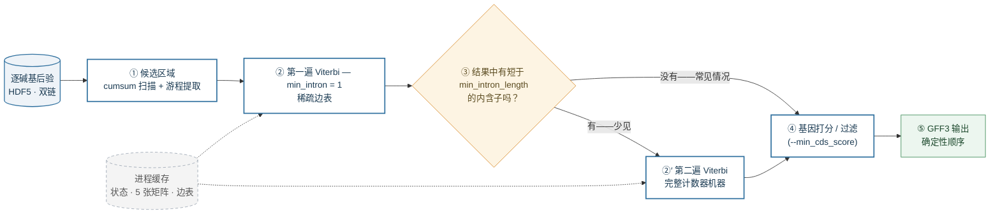
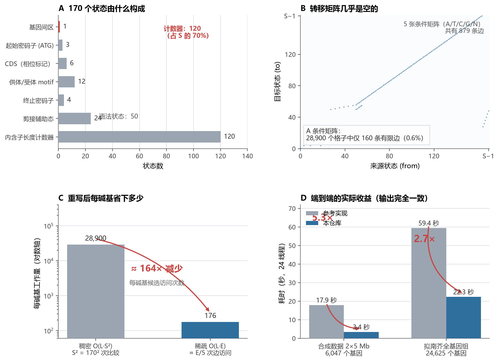
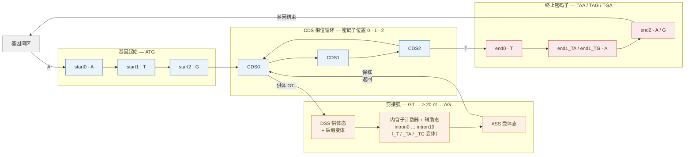

# 深入 ANNEVO-Fast 解码器

[English](decoding-internals.md) | **中文**

*基因语法 HMM 提速 3–5 倍，而输出一个碱基都不变。*

本文讲解 ANNEVO-Fast 解码部分（`decoding.py`、`src/HMM.py`、`src/gene_decoding.py`）背后的算法与工程实现。写给懂基因组和神经网络、但不一定接触过 HMM 的读者，可以顺序通读：术语在首次出现时都会给一句定义，每一节先讲直觉，再讲细节。

除特别说明外，以下所有数字均在 `min_intron_length = 20` 下对本仓库代码实测得到。

### 一分钟术语表

| 术语 | 在本文语境下的大白话 |
|---|---|
| *后验概率* (posterior) | 网络对每个碱基、15 个类别各自的置信度（"87% 外显子、3% 内含子……"） |
| *HMM*（隐马尔可夫模型） | 一台状态机：一盒**状态** + 一本规定**哪些状态可以接哪些状态**的规则书 |
| *状态* (state) | 机器的一个节点（"当前在内含子里，已走 7 个碱基"） |
| *转移* (transition) | 一次合法走法，带一个分数（如"留在内含子：−0.05"） |
| *发射* (emission) | "状态 X 与网络在这个碱基上的标签一致"所得的分数 |
| *Viterbi*（维特比） | 动态规划：逐碱基找出穿过状态机的最高分合法路径的经典算法 |

---

## 1. 解码器解决什么问题

把神经网络想象成一个打字很快、准确率 98% 的打字员，把解码器想象成它的语法检查器。

ANNEVO 类模型对基因组每条链的每个碱基输出一个 15 类后验分布（下表按模型训练时的标签顺序排列）：

```
0  基因间区          5  Intron_1         10 ASS_0   （受体）
1  Coding_exon_0    6  Intron_2         11 ASS_1
2  Coding_exon_1    7  DSS_0            12 ASS_2
3  Coding_exon_2    8  DSS_1            13 start
4  Intron_0         9  DSS_2            14 end
```

98% 的准确率听起来很好——但那 2% 的错误碱基是随机散布的，而一个基因只有**每个碱基都对**才算对。直接逐碱基取 argmax，原始输出里会有 3 bp 长的内含子、有供体位点却没有受体、外显子之间阅读框乱跳——这些在生物学上不可能存在，输出里也不该存在。

因此解码器的任务是找出**语法合法的最高分路径**：它可以为了维持叙事连贯而翻转一些低置信度碱基，但绝不违反规则。这恰好就是在一个手工设计的 HMM 上做 Viterbi 解码。

整条管线一句话概括：*用阈值圈出候选区域 → 每个区域过一遍语法机器 → 打分过滤基因 → 写出 GFF3*。画成图：



*图 0 —— 一个解码任务的完整流程。* ① 便宜的阈值法（50 bp 窗口均值加上每碱基高置信计数；§5）把基因组剪裁成少量候选区域，昂贵的 Viterbi 从不跑在基因间荒漠上。② 第一遍用折叠了计数器链的机器解码（`min_intron = 1`）——机器更小，结果也不受多余约束。③ 检查结果里有没有低于要求最小值的内含子；如果没有——常见情况——路径已是最终答案，②′ 整个跳过（§2.2）。④ 基因打分过滤（`--min_cds_score`，§6），⑤ 按确定性顺序写出。灰色虚线的缓存保存状态表、五张条件矩阵和编译好的边表；每个 worker 进程只建一次、被所有 Viterbi 调用共享（§4.4）——有了它，fork 进程池几乎没有启动成本。



***图 1 —— 整个故事的一张图。*** 从左到右、从上到下读：

- **(A) 机器由什么构成。** `min_intron_length = 20` 时 HMM 的状态家族（§2.1）。基因语法本身只需要 **50 个状态**；另外 **120 个**（红色）是内含子长度计数器链——6 个后缀家族 × 20 级计数器——它们存在的唯一意义是让短于 20 nt 的内含子在拓扑上不可能出现。占大头的不是语法本身，而是这套记账装置——而 S 越大，稠密内循环付出的 S² 代价就越大。

- **(B) 稠密循环为什么是浪费。** A 条件转移矩阵的每一个*有限*条目，画在它的 `(from, to)` 坐标上：**28,900 个格子里只有 160 个亮点（0.6%）**。这张图不是示意图——绘图脚本直接导入本仓库的 HMM，画的就是真实边表。稠密的横带是计数器链（每个计数器恰好一个后继；§2.1）；原点附近的结构是 CDS/剪接语法。另外四张条件矩阵（T/C/G/N）形态相似，共 **879 条边**。稠密 Viterbi 每碱基要比较全部 28,900 个格子；稀疏版只碰发亮的那几个。

- **(C) 每碱基省下多少。** 对数轴上的内循环每碱基要访问多少候选：S² = 28,900 次比较（绝大多数在跟永远赢不了的 −∞ 权重比）vs ≈ 176 次边访问——每碱基只查当前核苷酸的那张表，所以是 E/5 ≈ 879/5。≈164× 是*内循环*的缩减比；端到端收益更小，因为重写之后 I/O、候选区域检测和格式化成了主导（§7）。

- **(D) 实际买到什么。** 完整解码的耗时，24 CPU 线程。合成数据 2×5 Mb 刻意包含短于最小值的内含子，触发两遍重解码路径（§2.2）；*拟南芥*是真实的 ~120 Mb 基因组、双链、24,625 个基因。两种情况下基因内容都与参考实现逐字节一致（§8）。

给要改发射代码的人一个实用提醒：解码器把后验喂给 HMM 状态组时应用了一个**固定的列置换**——每个相位结构家族中，标签命名与 HMM 相位组的两个非零相位是互换的（例如 HMM 的 `CODING_EXON_1` 状态读的是预测*第 3 列*，`DSS_1` 读第 9 列，`ASS_2` 读第 11 列）。这个映射硬编码在 `viterbi_decoding` 里，必须与 checkpoint 的训练约定一致。

---

## 2. 基因语法 HMM

这台机器像一副 170 个格子的棋盘：格子就是状态，再配一本规则书，写明哪个格子后面能接哪个、每步合法走法值多少分。逐碱基在棋盘上行走，走出来就是一个基因；Viterbi（§3）找的是得分最高的合法走法。**规则书就是生物学。**

### 2.1 状态清单

`min_intron_length = 20` 时机器共有 **170 个状态**，分七族：

| 家族 | 数量 | 例子 | 角色 |
|---|---|---|---|
| 基因间区 | 1 | `intergenic` | 基因之间 |
| 起始密码子 | 3 | `start0..start2` | 拼 ATG |
| CDS（相位标记） | 6 | `CDS0`, `CDS0_T`, `CDS1`, `CDS1_TA`, `CDS1_TG`, `CDS2` | 外显子主体，密码子内位置 |
| 供体/受体 motif | 12 | `DSS0`, `DSS1_TA`, `ASS2`, … | 在剪接位点两侧拼 GT…AG |
| 终止密码子 | 4 | `end0`, `end1_TA`, `end1_TG`, `end2` | 拼 TAA / TAG / TGA |
| 剪接辅助态 | 24 | `intron1_TG_splice0..3` | 在内含子内消费 GT…AG motif |
| 内含子长度计数器 | 120 | `intron0_17`, `intron2_0`, … | 强制 `min_intron_length` |



*图 2 —— 语法主干。* 蓝色：CDS 相位循环——基因体就是绕着 `CDS0 → CDS1 → CDS2 → CDS0` 的一圈圈行走，一圈一个密码子；起始密码子（`ATG`）从 `intergenic` 放行入内，行走经内含子中断后必须回到正确的相位。橙色：剪接弧——供体位点（`GT`）进入内含子计数器 + motif 辅助态，走满 ≥ 20 nt，从受体（`AG`）*保持阅读框*地回到相位循环。红色：终止路径——`CDS2` 之后拼出 `TAA`/`TAG`/`TGA` 关闭基因、回到 `intergenic`。为可读性省略了：跨剪接弧携带半成品密码子的后缀变体（§2.1）、从 `CDS1`/`ASS1` 出发的第二条弧、以及 N 碱基回退路径。完整机器按每个后缀家族实例化 `min_intron_length` 级计数器——默认 20 时共 170 个状态（图 1A）。

三个设计点值得展开。

**跨内含子保住阅读框。** 基因按三碱基密码子阅读，而内含子可以插在基因的任意位置——甚至插到一个密码子中间。机器走进内含子之前，必须记住当前密码子已经写了一半写到哪，否则受体之后阅读框就接错了。它用后缀标签做到这一点：`CDS1_TA` 意思是"密码子位置 1，目前已拼出 TA"。标签沿整条剪接弧传播——CDS → 供体 → 内含子 → 受体——通过后缀匹配的走法，例如 `CDS0_T --A--> DSS1_TA`、`DSS0_T --G--> intron0_T_splice0`、`intron0_T_splice3 --A--> ASS1_TA`、`ASS1_TA --T--> CDS2`。供体前写了一半的密码子，跨过内含子在受体后补完——阅读框和终止密码子的识别都从正确的碱基继续。

**终止密码子。** 由专门的红色链条拼出：当前碱基是 T 时走 `CDS2 → end0`（下一个框内密码子以 T 开头），接着 A 走 `end0 → end1_TA`、G 走 `end0 → end1_TG`，最后 `end1 → end2`——从 `end1_TA` 补 A 或 G 得到 TAA/TAG，从 `end1_TG` 补 A 得到 TGA。受体出口也能直接开始拼终止密码子（T 时 `intron2_splice3 → end0`：相位 2 的内含子在受体处刚好补完自己的密码子，下一个碱基开始新密码子）；`end2 → intergenic` 关闭整个基因。

**最小内含子长度靠拓扑，不靠打分。** "内含子必须 ≥ 20 nt"光靠分数压不住——干净的做法是让短内含子*根本无法表示*：20 个计数器状态排成一排，每个恰好一个后继，任何合法走法穿过它们至少 20 步。这就是计数器占 170 个状态中 120 个的原因（图 1A），也是机器规模随 `min_intron_length` 线性增长的原因。

**按碱基分册的规则书。** 规则书一共有**五本**（即五张转移矩阵）——当前碱基是 A、T、C、G、N 时各用一本——因为语法本身就是看碱基的：`start1 → start2` 只在碱基为 G 时触发（补完 ATG），供体只在 G 时进入，GC-AG 供体在 C 时吃罚分。N（模糊碱基，组装里常见）下所有条件走法以固定 −10 罚分开放，让含 N 的区域优雅降级，而不是把基因打断。

**发射。** 发射分数就是网络对该状态类别的后验（下限 ε = 1e-3、取对数）——机器的分值来自规则书，它的"证据"来自网络。

### 2.2 两遍解码

用计数器状态强制 `min_intron_length`，在无约束最优路径本来就没有短内含子时反而可能*逼出*更差的路径（计数器会把机器限制得比实际需要的更死）。因此解码器解两遍：先用 `min_intron_length = 1`（计数器折叠）解一遍，然后——仅当结果里确实出现短于目标值的内含子时——再用完整计数器机器重解（`decode_gene_structure`）。实践中第二遍很少触发；不需要时跳过它既更快、也略更准。

---

## 3. 瓶颈：稠密 Viterbi

教科书式的 Viterbi 更新在每个碱基处问：*对我现在可能处于的每个状态，哪个前驱状态给分最高？* S 个状态就是每碱基 S × S 次比较。S = 170 时：**每碱基、每链 28,900 次比较**——10 Mb 染色体约 3×10¹¹ 次。

浪费就在这里：规则书几乎是空的（图 1B）。典型状态只有 **1–4 步合法走法**；其余 166 个左右的"前驱状态"权重全是 −∞，永远赢不了。稠密算法几乎所有时间都在检查非法走法——就像要找地铁线的上一站，却给*全城每个车站*都打一遍电话，而线路图上明明只列着相连的两三站。

在稠密循环本身之外，参考管线还有两个雪上加霜之处：五张 S×S 矩阵**每个候选区域**都用 Python 循环重建一遍（尽管它们只依赖五个参数）；以及逐碱基的字典查找编码。

---

## 4. 解法：预计算合法走法 —— O(L·E)

### 4.1 数据结构

不存五张 S×S 大网格，改存一份合法走法的扁平清单——就是地铁线路图本身，而且摆成内循环不用思考就能直接走的形式：

```
edge_from[e]  : 走法 e 的来源状态           (int32)
edge_w[e]     : 走法 e 的分数               (float32)
to_ptr[s, j]  : 当前碱基为符号 s 时，进入目标状态 j 的走法
                占据连续区间 [to_ptr[s, j], to_ptr[s, j+1])
```

走法按符号分组、组内按**（目标, 来源）升序**拼接（`np.lexsort((fr, to))`），所以 `to_ptr` 就是普通的前缀和索引。具体到某张符号表，内存长这样：

```
                       目标状态 j           目标状态 j+1
                     ┌ ─ ─ ─ ─ ─ ─ ─ ─ ─ ┬ ─ ─ ─ ─ ─ ─ ─ ─ ─ ┐
 to_ptr[s, j] ──►    │ e=7  e=8  e=9  e=10 │ e=11 e=12 ...
                     │ (from, w) 对 ...     │
 edge_from  [ 7] =    3     41    77   112     5    88   ...
 edge_w     [ 7] =  -2.1  -0.4  -3.7  -2.1   -0.4  -5.0  ...
                     └ ─ ─ ─ ─ ▲ ─ ─ ─ ─ ─ ┴ ─ ─ ─ ─ ▲ ─ ─ ─ ┘
                        to_ptr[s, j]        to_ptr[s, j+1]

 目标块内的走法按来源索引升序排列——
 严格 ">" 更新下，平局时 FIRST（最小）来源获胜，
 与参考实现的 for-i-in-0..S-1 循环完全一致
```

`min_intron_length = 20` 时五本规则书共 **879 步合法走法**（对比 5 × 28,900 = 144,500 个稠密格子）。每碱基只查当前核苷酸那本规则书——平均 **~176 次走法访问**，对比 28,900 次状态对比较，内循环缩减 **≈164×**（图 1C）。

*图解 —— 边表的解剖（索引为示意）。* 三个平行扁平数组取代五张 S×S 网格：`edge_from`/`edge_w` 存每步合法走法的来源状态与分数、按符号拼接；`to_ptr` 是对目标的前缀和，所以 `[to_ptr[s, j], to_ptr[s, j+1])` 恰好是当前碱基为符号 `s` 时**进入**目标状态 `j` 的全部走法——这里是 `e=7..10` 四步。没有搜索、没有掩码、没有 −∞ 扫描：一个（碱基, 状态）对的 Viterbi 更新就是在这个切片上的一段有界行走。而块内来源升序不只是内存布局的选择——它*就是* §4.3 的平局裁决规则：内存布局与正确性论证，在这里是同一件事。

### 4.2 内核

```python
@njit(cache=True)
def _viterbi_core_sparse_f32(log_emit_probs, edge_from, edge_weight, to_ptr, sequence_codes):
    for t in range(1, seq_length):
        sym = sequence_codes[t]
        for to_state in range(num_states):
            best_score = -inf; best_from = 0
            emit = log_emit_probs[t, to_state]
            for e in range(to_ptr[sym, to_state], to_ptr[sym, to_state + 1]):
                score = dp[t-1, edge_from[e]] + edge_weight[e] + emit
                if score > best_score:      # 严格大于
                    best_score = score; best_from = edge_from[e]
            dp[t, to_state] = best_score
            path[t, to_state] = best_from
```

内层循环是对连续内存的紧凑行走——numba JIT 恰好能把它编成飞快的机器码，而稠密 `numpy` 的行最大值恰好无法在不物化 S×S 中间件的情况下表达它。两个精度变体都编译（区域 ≤ 1 Mb 用 f32，更长的用 f64），与参考实现的 dtype 选择一致，两种 regime 下结果保持一致。

### 4.3 做到逐位一致 —— 真正的约束

快从来不是难点；**输出完全相同**才是。任何人都能写一个*几乎一样*的更快解码器；这里的要求是下游工具看到与从前相同的基因。三条规则使稀疏内核产出与稠密参考相同的分值、相同的回溯指针、从而相同的解码路径——不是统计意义上，而是逐位：

1. **按相同顺序相加。** 候选分按 `(dp_prev + w) + emit` 计算——与参考实现相同的从左到右分组。浮点加法的舍入随分组而变，第 4,000,001 位上的一个 ulp 差异就可能翻转一条路径。
2. **按相同方式破平局。** 两步走法得分*恰好相等*时，两个实现都保留来自最小编号状态的那个：参考实现靠 `i = 0..S-1` 循环加严格 `>` 隐式获得；稀疏表靠按来源索引排序加同样的严格 `>` 复现。
3. **确定性建表。** `lexsort` 构造是其参数的纯函数，每个进程建出的表完全相同。

### 4.4 其余全部缓存

状态、五本规则书、编译好的边表每个进程只建一次，按
`(min_intron_length, expect_exon, expect_intron, gcag, atac)` 记忆化——参考实现是每个区域重建。numba 内核缓存到磁盘（`cache=True`），进程池里的 worker 既不用等 JIT 编译，也不用重建表格。碱基编码是从原始 ASCII 缓冲区查 256 项查找表，替代逐碱基字典查找——小优化，但在每染色体 10⁷ 碱基的尺度上有意义。

---

## 5. 内核之外的全部向量化

只重写 Viterbi、其余管线留在 Python 循环里是没有意义的。每个阶段都用 numpy 在同样的"结果逐位一致"纪律下重做：

| 阶段 | 参考实现 | 本仓库 |
|---|---|---|
| 候选区域 | 每 50bp 窗口的 Python 循环 | `cumsum` 窗口和 + 游程提取；均值公式逐项一致 |
| 区域合并 | 区间并、100 bp 缓冲 | 未改 |
| 状态 → 类别折叠 | 逐碱基集合成员判断 | 查找表 + `np.take` |
| CDS/内含子区间 | `pandas.groupby(...).apply(lambda ...)` | numpy 游程编码（去掉 pandas 依赖） |
| 基因打分 | 三重逐碱基 Python 循环 | 向量化切片求和；**float64 顺序 `cumsum`**，保持参考实现从左到右的累加顺序 |
| H5 访问 | 每个 segment 开一次文件 | 每 16-segment 批开一次 |
| 输出顺序 | 进程完成顺序（不确定） | 染色体字典序 |

float64 那一行是 §4.3 的缩影：基因得分是数百万个后验的和，numpy 默认的 `sum`（两两归约）与参考实现的顺序累加舍入不同——足以把一个基因推过 `--min_cds_score` 过滤线。`cumsum` 后取末项的写法保持和完全一致。并行是区域批上的扁平 `ProcessPoolExecutor`；第一批跑完之后，每个 worker 的缓存都已就位（§4.4）。

---

## 6. 用一点速度换精度的旋钮

三个可选行为；前两个完全不改变默认输出：

- **`--atac_penalty <x>`**——加 AT-AC（U12 型次要剪接）状态：供体前是 AT、受体以 C 结尾。九个额外状态；该路径上的阅读框记账做近似（约 0.1% 的内含子）。
- **`--gcag_penalty`**——GC-AG 供体相对经典 GT 的额外 log 罚分（默认 10，历史值）。
- **`--min_cds_score`**——基因必须达到的平均逐碱基发射分（单外显子和短基因按 1.5× 要求）。默认 0.6（历史值 0.5）在植物基准上重新校准过，值 **+0.2–0.4 pp 基因 F1**。与前两个不同，它按设计改变输出；设回 0.5 可复现历史过滤行为。

---

## 7. 结果与时间去哪了

24 CPU 线程，输出基因内容与参考实现一致：

| 任务 | 参考实现 | 本仓库 | 加速 |
|---|---|---|---|
| 合成数据 2×5 Mb，6,047 个基因（触发短内含子重解码路径） | 17.9 s | 3.4 s | **5.3×** |
| *拟南芥* 全基因组，24,625 个基因 | 59.4 s | 22.3 s | **2.7×** |

为什么内循环缩小 ~164×，端到端只有 2.7–5.3×？因为重写之后内循环已经从 profile 里消失了：剩余时间在读 H5 后验、找候选区域、格式化写 GFF 和进程池开销上。再压缩一个已经不再是瓶颈的环节，总时间也不会跟着降——熟悉的 Amdahl 定律。（在碎片化的草稿组装上，*预测器*侧——跨 scaffold 分块批处理——是更大的杠杆；见 README。）

---

## 8. 如何验证这样的重写

等价性声明建立在三层之上，强度递增：

1. **构造本身是确定的**——边表是其参数的纯函数；解码路径跨运行、跨进程可复现。
2. **合成数据差分测试**——已知真值的基因组，刻意包含短于 `min_intron_length` 的内含子以强制触发重解码路径；GFF 逐字节比较。
3. **全基因组差分运行**——真实 *拟南芥*：双链 24,625 个基因；本解码器与参考实现的所有基因内容行完全一致。（只有每条序列注释块的顺序不同——参考实现按进程完成顺序输出，本身逐次运行就不确定；本仓库按字典序输出。）

第 3 层对任何移植此方法的人都有一条教训：**"相同答案"的定义必须包含平局裁决与浮点舍入**，否则你的 diff 会充满单碱基位移，其实只是另一条得分相同的最优路径。

---

## 9. 总结

| 方面 | 参考实现 | 本仓库 |
|---|---|---|
| Viterbi 内循环 | O(L·S²) 稠密——每碱基 ~28,900 次比较 | O(L·E) 稀疏边表——每碱基 ~176 次走法访问 |
| 转移矩阵 | 每区域重建 | 每进程一次、记忆化；numba 磁盘缓存 |
| 精度策略 | 按区域长度 f32 / f64 | 相同，两个内核都编译 |
| 等价性 | — | 路径逐位一致（固定求值顺序 + 来源升序平局裁决） |
| 管线 | pandas + Python 循环 | 全程 numpy 游程/cumsum，无 pandas |
| H5 访问 | 每 segment 开文件 | 每批开文件 |
| 输出 | 段落顺序不确定 | 确定性字典序 |
| 附加 | — | AT-AC 路径、GC-AG 旋钮、校准的 CDS 过滤 |

可迁移的教训不止于基因预测：**结构化 HMM 几乎总是稀疏的，而稠密实现对此视而不见。** 把规则书写成一张边表，并刻意控制求和顺序与平局裁决——内循环从 O(S²) 降到 O(E)，可复现性反而更有保障，而不是更弱。
